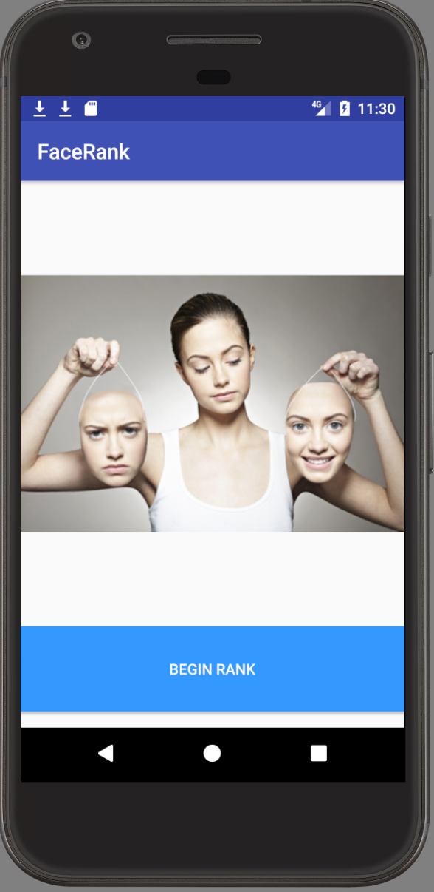
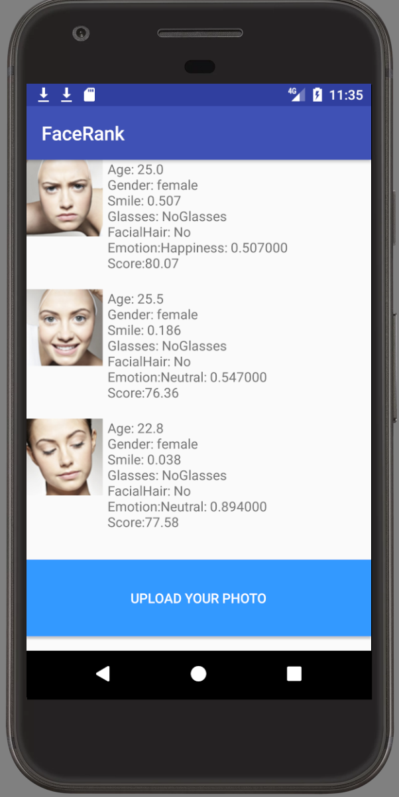
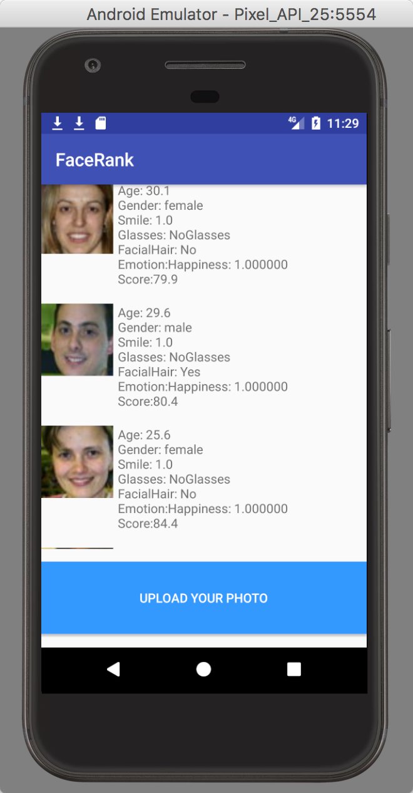

# FaceRank

- This project is a lite app that can detect face and give some scores based on Photo given.
- This project used Oxford Face API sample code and Microsoft Face API
- This project is good to learn and is a good sample for Face API starter

### Upload

### Result

